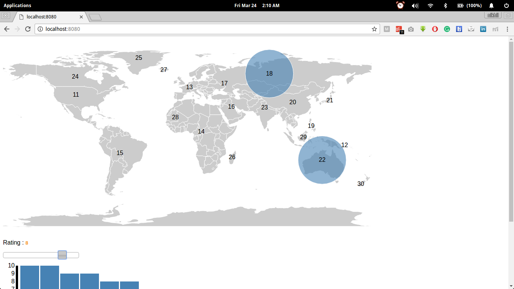

# D3-Pincode Application(Loginext Assignment)

It is simple d3 application in which we have pincode of different regions and ratings corresponding to that region. We have to built a world map which will display the location of all these pincodes with there ratings as a circle, the one with larger rating should have a larger circle.





## Getting Started

These instructions will get you a copy of the project up and running on your local machine for development and testing purposes.


## Running the app

Use below command, to start the server locally
```
http-server
```
After that, type 
```
http://localhost:8080/
```
in the browser.

### Functionalities

* User can slide the rating slider to display the circle of corresponding pincodes.
* There is bar graph attached which will give information about the top 10 pincodes.

## Authors

* **Nikhil Mehandiratta** - *Initial work* - [someone12321](https://github.com/someone12321)
